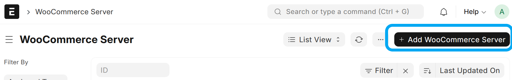
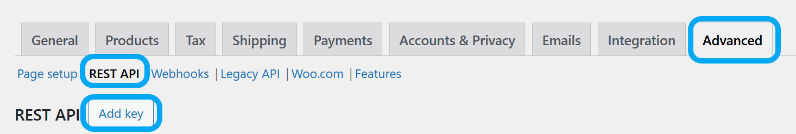
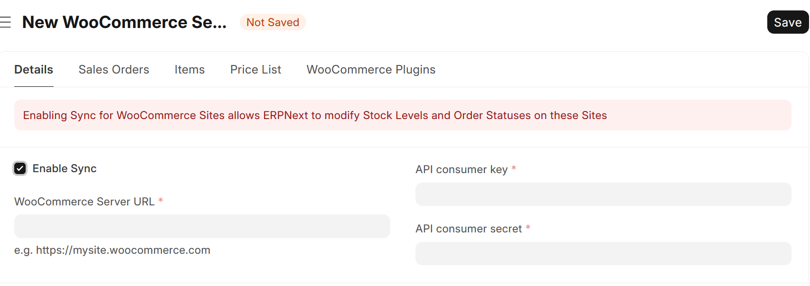
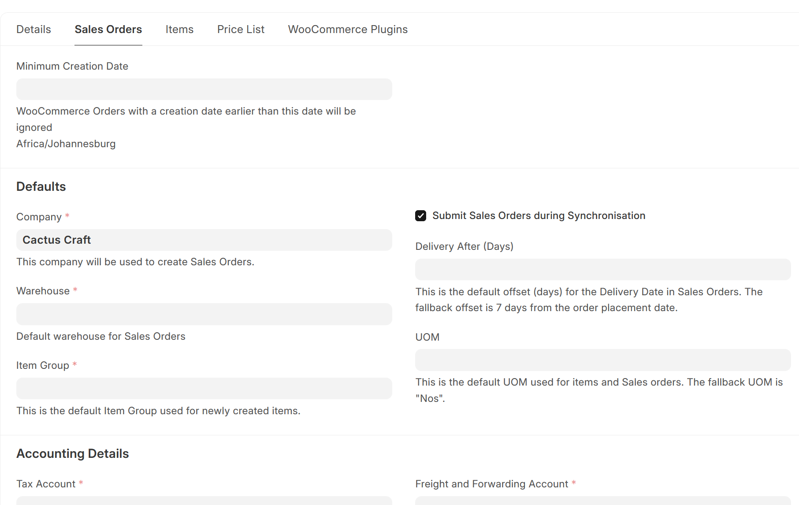

# Configure WooCommerce Fusion

---

The first step is to create a **WooCommerce Server** document, representing your WooCommerce website.

Complete the "WooCommerce Server URL", "API consumer key" and "API consumer secret" fields. To find your API consumer key and secret, go to your WordPress admin panel and navigate to WooCommerce > Settings > Advanced > REST API, and click on "Add key". Make sure to add Read/Write permissions to the API key.

---

Click on the "Sales Orders" tab and complete the mandatory fields

**Settings**:
- Synchronise Sales Order Line changes back

When set, adding/removing/changing Sales Order Lines will be synchronised back to the WooCommerce Order.

---

Click on the "Save" - and you are ready to go!
