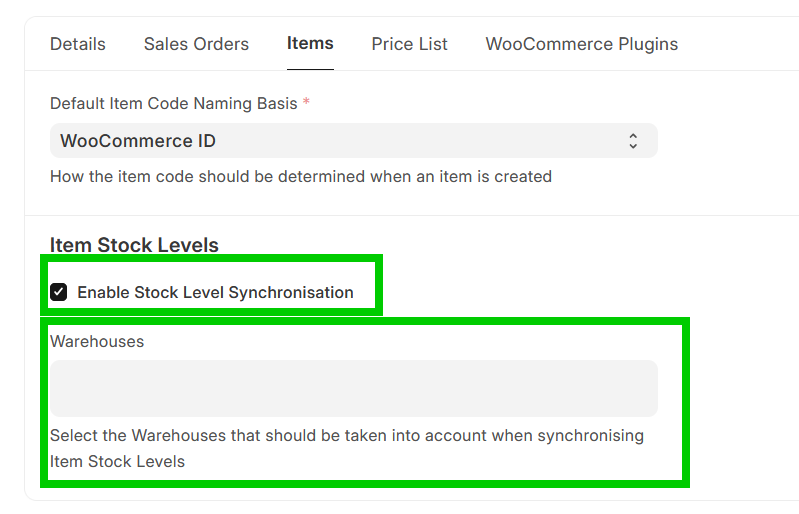

# Configure WooCommerce Fusion

---

The first step is to create a **WooCommerce Server** document, representing your WooCommerce website.


Complete the "WooCommerce Server URL", "API consumer key" and "API consumer secret" fields. To find your API consumer key and secret, go to your WordPress admin panel and navigate to WooCommerce > Settings > Advanced > REST API, and click on "Add key". Make sure to add Read/Write permissions to the API key.


---

Click on the "Sales Orders" tab and complete the mandatory fields


**Settings**:
- Synchronise Sales Order Line changes back

When set, adding/removing/changing Sales Order **Lines** will be synchronised back to the WooCommerce Order (Note: Sales Orders will always be synchronised, this setting is for sync'ing changed Sales Order **Lines** *back* to WooCommerce)

- Enable Payments Sync

Let the app create Payment Entries for paid Sales Orders. A mapping of Payment Method to Bank Account is required:
```json
{
   "bacs": "1000-000 Bank Account",
   "cheque": "1000-100 Other Bank Account"
}
```
---

Click on the "Items" tab if you want to turn on Stock Level Synchronisation



**Settings**:
-  Default Item Code Naming Basis
   -  How the item code should be determined when an item is created, either "WooCommerce ID" or "Product SKU".
-  Enable Stock Level Synchronisation
   -  Turns on Syncrhonisation of Item Stock Levels to WooCommerce
-  Warehouses
   -  Select the Warehouses that should be taken into account when synchronising Item Stock Levels

---

Click on the "Save" - and you are ready to go!
