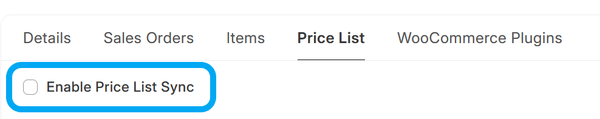

# Sync Item Prices from ERPNext to WooCommerce

## Background Job

If *Price List Sync* is enabled, every day, a background task runs that performs the following steps:
1. Get list of ERPNext Item Prices to synchronise, based on the *Price List* setting
2. Synchronise Item Prices with WooCommerce Products

## Hooks

If *Price List Sync* is enabled, a product update API request will be made when the following documents are updated:
- Item Price

## Manual Trigger
Price List Synchronisation can also be triggered from an **Item**, by clicking on *Actions* > *Sync this Item's Price to WooCommerce*

## Troubleshooting
- You can look at the list of **WooCommerce Products** from within ERPNext by opening the **WooCommerce Product** doctype. This is a [Virtual DocType](https://frappeframework.com/docs/v15/user/en/basics/doctypes/virtual-doctype) that interacts directly with your WooCommerce site's API interface
- Any errors during this process can be found under **Error Log**.
- You can also check the **Scheduled Job Log** for the `sync_item_prices.run_item_price_sync` Scheduled Job.
- A history of all API calls made to your Wordpress Site can be found under **WooCommerce Request Log**
