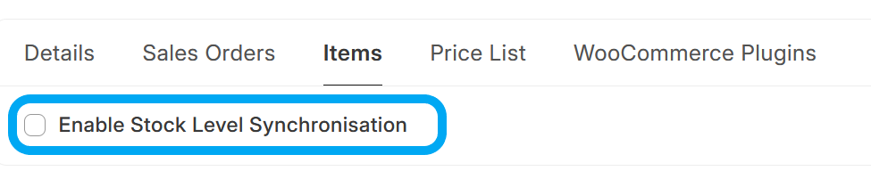

# Sync Item Stock Levels from ERPNext to WooCommerce

## Background Job

If *Stock Level Sync* is enabled, every day, a background task runs that performs the following steps:
1. Get all *enabled* items
2. For every WooCommerce-linked item, sum all quantities from all warehouses and round the total down (WooCommerce API doesn't accept float values)
3. For every item post the new stock level to WooCommerce

## Hooks

If *Stock Level Sync* is enabled, a stock level API post will be made when the following documents are submitted or cancelled:
- Stock Entry
- Stock Reconciliation
- Sales Invoice
- Delivery Note

## Manual Trigger
Stock Level Synchronisation can also be triggered from an **Item**, by clicking on *Actions* > *Sync this Item's Stock Levels to WooCommerce*

## Troubleshooting
- You can look at the list of **WooCommerce Products** from within ERPNext by opening the **WooCommerce Product** doctype. This is a [Virtual DocType](https://frappeframework.com/docs/v15/user/en/basics/doctypes/virtual-doctype) that interacts directly with your WooCommerce site's API interface
- Any errors during this process can be found under **Error Log**.
- You can also check the **Scheduled Job Log** for the `stock_update.update_stock_levels_for_all_enabled_items_in_background` Scheduled Job.
- A history of all API calls made to your Wordpress Site can be found under **WooCommerce Request Log**
