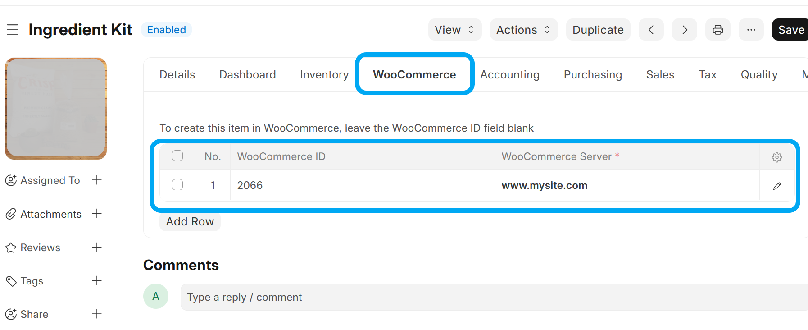
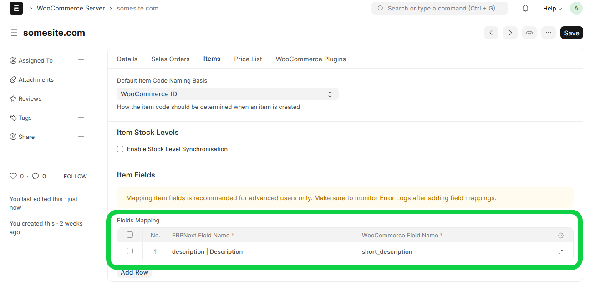

# Items Sync

## Setup

To link your ERPNext Item to a WooCommerce Product:
- If the WooCommerce Product already exists, specify the WooCommerce ID and WooCommerce Server
- If you want the item to be created in WooCommerce, specify only the WooCommerce Server

## Hooks

- Every time an Item is updated or created, a synchronisation will take place for the item if:
  -  A row exists in the **Item's** *WooCommerce Servers* child table with a blank/empty *WooCommerce ID* and *Enable Sync* is ticked: A linked WooCommerce Product will be created.
  -  A row exists in the **Item's** *WooCommerce Servers* child table with a value set in *WooCommerce ID* and *Enable Sync* is ticked: The existing WooCommerce Product will be updated

## Background Job

Every hour, a background task runs that performs the following steps:
1. Retrieve a list of **WooCommerce Products** that have been modified since the *Last Syncronisation Date* (on **WooCommerce Integration Settings**) 
2. Compare each **WooCommerce Product** with its ERPNext **Item** counterpart, creating an **Item** if it doesn't exist or updating the relevant **Item**

## Synchronisation Logic
When comparing a **WooCommerce Item** with it's counterpart ERPNext **Item**, the `date_modified` field on **WooCommerce Item** is compared with the `modified` field of ERPNext **Item**. The last modified document will be used as master when syncronising

## Fields Mapping

| WooCommerce  | ERPNext      | Note                                                                                          |
| ------------ | ------------ | --------------------------------------------------------------------------------------------- |
| `id`         | *Item Code*  | Only if *Default Item Code Naming Basis* is set to *WooCommerce ID* on **WooCommerce Server** |
| `sku`        | *Item Code*  | Only if *Default Item Code Naming Basis* is set to *Product SKU* on **WooCommerce Server**    |
| `name`       | *Item Name*  |                                                                                               |
| `type`       |              | `simple` ≡ Normal **Item**                                                                    |
|              |              | `variable` ≡ Template **Item** (*Has Variants* is checked).                                   |
|              |              | `variant` ≡ **Item** Variant (*Variant Of* is set)                                            |
| `attributes` | *Attributes* | Missing **Item Attributes* will automatically be created in both systems                      |

## Custom Fields Mapping
It is possible to map fields that you want to be synchronised. For example, to synchronise a **WooCommerce Product**'s `short_description` field to an ERPNext **Item**'s `description` field, add the following *Field Mapping*:

**Note that this is recommended for advanced users only. This is a very basic functionality - there are no field type conversions possible as of yet.

## Troubleshooting
- You can look at the list of **WooCommerce Products** from within ERPNext by opening the **WooCommerce Product** doctype. This is a [Virtual DocType](https://frappeframework.com/docs/v15/user/en/basics/doctypes/virtual-doctype) that interacts directly with your WooCommerce site's API interface
- Any errors during this process can be found under **Error Log**.
- You can also check the **Scheduled Job Log** for the `sync_items.run_items_sync` Scheduled Job.
- A history of all API calls made to your Wordpress Site can be found under **WooCommerce Request Log**

